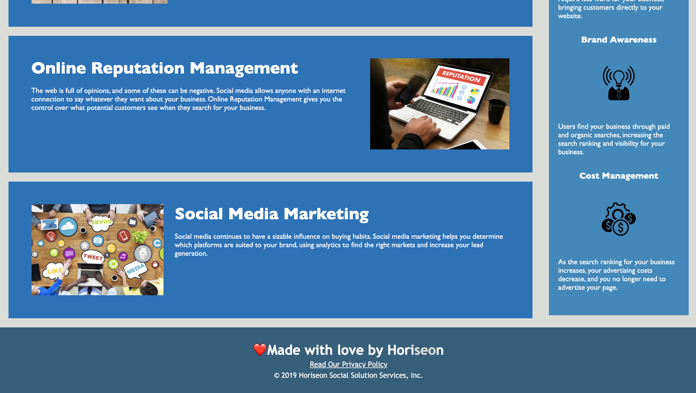

# Horiseon website code refactoring

## Purpose
This project takes starter code and refactors it to increase accessibility and ensure links function correctly. It simplifies, consolidates, and organizes CSS selectors and properties and restructures and simplifies HTML elements.

## Built With 
* HTML
* CSS

## Website
https://mallynnk.github.io/Horiseon-Refactor/

## Screenshot
 
 
 

## Contribution 
Mallory Korpics